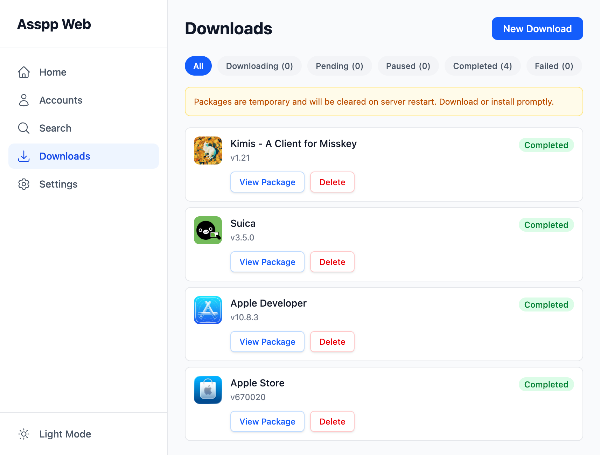

# AssppWeb

A web-based tool for acquiring and installing iOS apps outside the App Store. Authenticate with your Apple ID, search for apps, acquire licenses, and install IPAs directly to your device.



## Zero-Trust Architecture

AssppWeb uses a zero-trust design where the server **never sees your Apple credentials**. All Apple API communication happens directly in your browser via WebAssembly (libcurl.js with Mbed TLS 1.3). The server only acts as a blind TCP relay (Wisp protocol) and handles IPA compilation from public CDN downloads.

> **⚠️ Important Security Notice:** There are no official Asspp Web instances. Use any public instance at your own risk. While the backend cannot read your encrypted traffic, a malicious host could serve a modified frontend to capture your credentials before encryption. Therefore, **do not blindly trust public instances**. We strongly recommend self-hosting your own instance or using one provided by a trusted partner. Always verify the SSL certificate and ensure you are connecting to a secure, authentic endpoint.

**恳请所有转发项目的博主对自己的受众进行网络安全技术科普。要有哪个不拎清的大头儿子搞出事情来都够我们喝一壶的。**

## Apple ID Login: SAP Request Signing

Apple now requires every authentication request to carry an SAP signature in the `X-Apple-ActionSignature` header; unsigned login requests are rejected. AssppWeb signs the exact plist body that is sent to Apple:

1. The login body is built as a plist XML string (`frontend/src/apple/plist.ts`).
2. `frontend/src/apple/sapSigner.ts` loads the browser-side signing engine from `/sap/` (`frontend/public/sap/`: `sap-signer.js` + `sap.wasm` + `unicorn_x86.js` + `wasm_exec.js`). The engine runs a WASM build of Apple's signing stack in the page.
3. The engine needs two Apple endpoints during setup:
   - `GET https://s.mzstatic.com/sap/setupCert.plist`
   - `POST https://fpinit.itunes.apple.com/v1/signSapSetup/legacy`
4. The resulting Base64 signature is attached to the login request as `X-Apple-ActionSignature` (`frontend/src/apple/authenticate.ts`).

### Why the setup endpoints go through the backend

`fpinit.itunes.apple.com` (like `init.itunes.apple.com`) **requires TLS 1.3**, but the browser-side WASM TLS stack used for the zero-trust direct connection does not support it — requests fail with `curl error 35: SSL connect error`. These two setup requests are therefore proxied through the backend:

- `backend/src/routes/sap.ts` exposes `GET/POST /api/sap?url=...` with a strict allow-list (only the two endpoints above), forwards them via Node's native HTTPS (TLS 1.3 capable), and enforces size/time limits.
- Only these public, credential-free setup requests are proxied. The login request itself — containing your credentials — is still sent directly from the browser to Apple over the Wisp tunnel; the server cannot read it.

### Troubleshooting

| Symptom | Cause | Fix |
| --- | --- | --- |
| `error code 35: SSL connect error` during login | SAP setup request bypassing the backend proxy | Update to a build containing `backend/src/routes/sap.ts` and rebuild both frontend and backend |
| Signature page hangs or `/sap/*` 404 | Static signing assets missing from the deployment | Ensure `frontend/public/sap/` is included in your build output (Vite copies it into `dist/`) |
| `401` on `/api/sap` | Access password enabled and token missing | Log in through the web UI so the `X-Access-Token` header is set |

## Apple ID 登录：SAP 请求签名（中文说明）

Apple 现在要求所有认证请求必须携带 SAP 签名（请求头 `X-Apple-ActionSignature`），未签名的登录请求会被拒绝。AssppWeb 对实际提交给 Apple 的 plist 请求体进行签名：

1. 登录请求体以 plist XML 字符串构建（`frontend/src/apple/plist.ts`）。
2. `frontend/src/apple/sapSigner.ts` 运行时从 `/sap/` 动态加载浏览器端签名引擎（`frontend/public/sap/`：`sap-signer.js` + `sap.wasm` + `unicorn_x86.js` + `wasm_exec.js`），在页面内以 WASM 运行 Apple 的签名栈。
3. 签名引擎初始化需要访问两个 Apple 端点：
   - `GET https://s.mzstatic.com/sap/setupCert.plist`
   - `POST https://fpinit.itunes.apple.com/v1/signSapSetup/legacy`
4. 得到的 Base64 签名以 `X-Apple-ActionSignature` 请求头附在登录请求上（`frontend/src/apple/authenticate.ts`）。

### 为什么 setup 请求要经后端代理

`fpinit.itunes.apple.com`（与 `init.itunes.apple.com` 同族）**要求 TLS 1.3**，而零信任直连所用的浏览器侧 WASM TLS 栈不支持 TLS 1.3 —— 直连会报 `curl error 35: SSL connect error`。因此这两个 setup 请求经后端代理：

- `backend/src/routes/sap.ts` 暴露 `GET/POST /api/sap?url=...`，带严格白名单（仅放行上述两个端点），用 Node 原生 HTTPS（支持 TLS 1.3）转发，并限制大小与耗时。
- 仅代理这两个不含凭据的公开 setup 请求；**包含账号密码的登录请求本身仍然由浏览器经 Wisp 隧道直连 Apple，服务端无法读取**。

### 常见问题排查

| 症状 | 原因 | 处理 |
| --- | --- | --- |
| 登录时报 `error code 35: SSL connect error` | SAP setup 请求绕过了后端代理 | 更新到包含 `backend/src/routes/sap.ts` 的版本，前端后端都要重新构建 |
| 签名页卡住或 `/sap/*` 404 | 部署缺少静态签名资源 | 确认 `frontend/public/sap/` 已包含在构建产物中（Vite 会拷入 `dist/`） |
| `/api/sap` 返回 `401` | 开启了访问密码且未携带令牌 | 先在网页 UI 完成密码验证（自动附带 `X-Access-Token` 头） |

## Quick Start

### Deploy to Cloudflare

[](https://deploy.workers.cloudflare.com/?url=https://github.com/Lakr233/AssppWeb&apiTokenTmpl=%5B%7B%22key%22%3A%22workers_scripts%22%2C%22type%22%3A%22write%22%7D%2C%7B%22key%22%3A%22containers%22%2C%22type%22%3A%22write%22%7D%2C%7B%22key%22%3A%22cloudchamber%22%2C%22type%22%3A%22write%22%7D%5D&apiTokenName=AssppWeb%20Deploy)

This uses Cloudflare Workers + Containers with the published image `ghcr.io/lakr233/assppweb:latest`.

Requirements:

- Cloudflare Workers **Paid** plan (Containers are not available on Free).
- Deploy/build token with:
  - `Workers Scripts Edit`
  - `Containers Edit`
  - `Cloudchamber Edit`

If your build log fails at `Deploy a container application` with `Unauthorized`, your build token is missing required Containers/Cloudchamber permissions.

### Deploy to Railway

<details>
<summary>Click to show Railway deployment instructions</summary>

1. Go to [railway.com/new/image](https://railway.com/new/image) → enter `ghcr.io/lakr233/assppweb:latest`
2. In service **Settings**, set **Healthcheck Path** to `/api/settings` and deploy
3. Right-click the service → **Attach volume** → mount path: `/data`
4. In **Variables**, set `DATA_DIR` = `/data` and deploy
5. In **Settings** → **Networking**, generate a public domain or add a custom domain

**Notes**

- The free trial works but has limitations (volume expiry, network restrictions). **Hobby** plan ($5/month) or above is recommended for reliable use.
- Enable [**Serverless**](https://docs.railway.com/deployments/serverless) in service settings to scale down to zero during idle periods
- Railway [auto-updates](https://docs.railway.com/deployments/image-auto-updates) `:latest` images from GHCR — new releases will be deployed automatically within a few hours

> **⚠️ Custom domain with Cloudflare:** Railway's Cloudflare integration creates DNS records with Proxy enabled (orange cloud) by default. After authorizing, go to Cloudflare DNS settings and switch the CNAME record to **DNS only** (gray cloud) — Railway handles TLS automatically. If you keep Cloudflare Proxy on, you must set SSL/TLS mode to **Full** (not Flexible or Full Strict), otherwise you'll get an infinite redirect loop. See [Railway docs](https://docs.railway.com/networking/troubleshooting/ssl#err_too_many_redirects).

</details>

### Self-Host with Docker Compose

<details>
<summary>Click to show manual Docker Compose setup instructions</summary>

**Setup Docker Compose**

```bash
curl -O https://raw.githubusercontent.com/Lakr233/AssppWeb/main/compose.yml
docker compose up -d
```

**Environment Variables**

| Variable                                    | Default         | Description                                                                                 |
| ------------------------------------------- | --------------- | ------------------------------------------------------------------------------------------- |
| `PORT`                                      | `8080`          | Server listen port                                                                          |
| `DATA_DIR`                                  | `./data`        | Directory for storing compiled IPAs                                                         |
| `PUBLIC_BASE_URL`                           | _(auto-detect)_ | Public URL for generating install manifests (e.g. `https://asspp.example.com`)              |
| `UNSAFE_DANGEROUSLY_DISABLE_HTTPS_REDIRECT` | `false`         | Disable HTTPS redirect (see warning below)                                                  |
| `AUTO_CLEANUP_DAYS`                         | `0`             | Automatically delete cached IPA files older than specified days (0 to disable)              |
| `AUTO_CLEANUP_MAX_MB`                       | `0`             | Automatically delete oldest cached IPA files when size exceeds this MB limit (0 to disable) |
| `MAX_DOWNLOAD_MB`                           | `0`             | Reject downloads exceeding this size in MB to prevent out-of-memory errors (0 to disable)   |
| `DOWNLOAD_THREADS`                          | `8`             | Number of parallel threads for IPA downloads (1–32)                                         |
| `ACCESS_PASSWORD`                           | _(none)_        | Require a password to access the web UI and API (empty to disable)                          |

**Reverse Proxy (Required for Install Apps on iOS)**

iOS requires HTTPS for `itms-services://` install links. You must put AssppWeb behind a reverse proxy with a valid TLS certificate.

> **⚠️ Redirect loop (`ERR_TOO_MANY_REDIRECTS`)?** Some reverse proxies (e.g. NAS built-in proxies) always send `X-Forwarded-Proto: http` even when the client connected via HTTPS, causing an infinite redirect loop. If you cannot configure your proxy to send the correct header, set `UNSAFE_DANGEROUSLY_DISABLE_HTTPS_REDIRECT=true` as a last resort. **This disables the HTTP→HTTPS redirect — you must ensure your proxy enforces HTTPS externally.**

The following is an example Caddyfile configuration:

```
asspp.example.com { reverse_proxy 127.0.0.1:8080 }
```

**⚠️ Make Sure WebSocket Works**

AssppWeb relies on the Wisp protocol over WebSocket (`/wisp/`) for its zero-trust architecture. Ensure your reverse proxy or CDN (e.g., Nginx, Cloudflare) is configured to allow WebSocket connections, otherwise the app will fail to communicate with Apple servers.

</details>

## Security Recommendations

**DDoS Protection**

IPA files can be hundreds of megabytes. If your instance is publicly accessible, put it behind a CDN like Cloudflare to absorb bandwidth and prevent abuse.

## License

MIT License. See [LICENSE](LICENSE) for details.

## 🥰 Acknowledgments

For projects that was stolen and used heavily:

- [ipatool](https://github.com/majd/ipatool)
- [Asspp](https://github.com/Lakr233/Asspp)

For friends who helped with testing and feedback:

- [@lbr77](https://github.com/lbr77)
- [@akinazuki](https://github.com/akinazuki)


